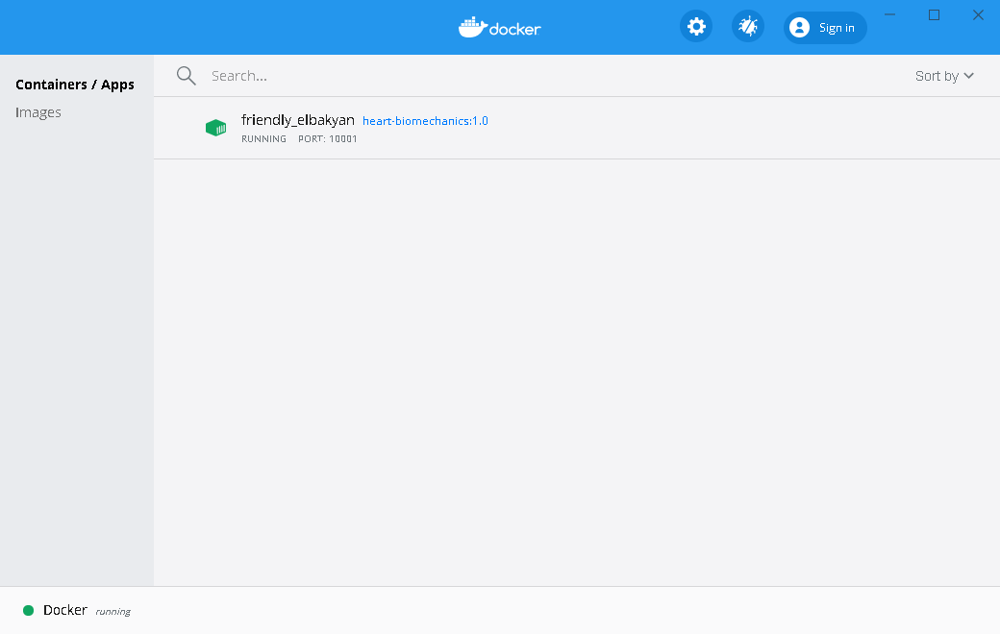

# Troubleshooting

1. The following error may be encountered when trying to execute the "docker run" command:
    ```bash
    Bind for 0.0.0.0:10000 failed: port is already allocated.
    ```
   Solutions:
   1. check that you do not have another instance of the heart-biomechanics container running, by opening the docker desktop application as shown below.
        
   If another instance is running, click on the container and click the stop button button to close the container, and try the command above again. 
   
   2. If the issue persists, then port number 10000 may be in use by another service. Replace the port number 10000 with another number e.g. 20000 and retry.

2. If you encounter the following error when trying to execute a docker on Windows:
    ```bash
    /home/jovyan/work/bashrc: line 7: $'\r': command not found
    Executing the command: bash
    /usr/local/bin/start.sh: line 148: exec: bash: not found
    ```
    There are scripts in the oc folder (described in the installation step) that are run via a linux terminal inside the docker container. This error indicates that a script in the oc folder has been altered to have windows style line endings (ie. carriage returns). This can happen if you try and open these scripts with notepad, wordpad, or other standard windows text editors. They will automatically save the file with Windows style line endings. Scripts with these line endings will not work on linux and gives rise to the error above (```$'\r': command not found```).
    
    To avoid this issue, do not open linux scripts with these editors on windows as advised in the OpenCMISS-Iron Docker installations steps. Instead, use a text editor like [Notepad++](https://notepad-plus-plus.org/downloads/). 
    
    To correct this issue, locate the script producing the error (in this case ```bashrc```) and open it in Notepad++ on your Windows host (remember that ```/home/jovyan/work``` inside the container is mapped to your ```oc/opt``` folder).  From the "Edit" menu, select "EOL Conversion" -> "UNIX/OSX Format". You can also set the default EOL in notepad++ via "Settings" -> "Preferences" -> "New Document/Default Directory" then select "Unix/OSX" under the Format box.