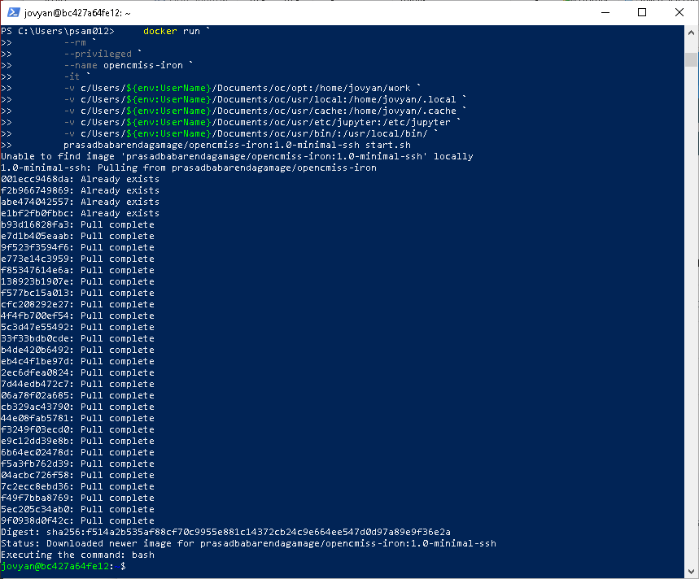

# Installation via Docker on local Windows, Linux, and Mac machines

## Directory setup
The OpenCMISS-Iron Docker user environment has the following folder structure:
```
oc
└───opt
|       bashrc
|
└───usr
    |
    └───bin
    │       start.sh
    │       start-notebook.sh
    │       start-singleuser.sh
    │       start-ssh-server.sh
    |       start-pycharm.sh
    |       mount-shared-drive.sh
    │       fix-permissions
    |
    └───etc
    │   │
    │   └───jupyter
    │           jupyter_notebook_config.py
    │   
    └───local
    │   
    └───cache
    │   
    └───java
    │   
    └───config
    │   
    └───PyCharm

```
This folder structure contains:

1. `oc/opt` - this will be your main working directory.
2. `oc/usr/bin` - folder containing scripts for running jupyter servers.
3. `oc/usr/etc/jupyter` - folder containing jupyter notebook configuration. 
4. `oc/usr/local` and `oc/usr/cache` - folders where new python modules installed will be stored.
5. `oc/usr/java`, `oc/usr/config`, and `oc/usr/PyCharm` - folders used by Pycharm.


``` Important:: The working oc/opt directory created on the host machine will be mapped to "/home/jovyan/work" within the Docker container. Only items within this folder will persist once the container is shutdown. Any files outside this container will not be recoverable (running a Docker container can be thought of as getting a new computer with a fresh installation - only items in the mapped drive will be available the next time you start the Docker container). 
```

This folder structure is stored in the following zip file ([zip file](../../_static/oc.zip)). Extract the folder as described below:

### Linux and Mac
Go to your home directory and extract the zip file. For example, on linux `~` refers to `/home/$USER/`. Once extracted, the `oc` folder should be found in `/home/$USER/oc`.

### Windows
Move the downloaded zip file to your `my documents` folder (this is typically located in `C:/Users/USER_NAME/Documents/`, where USER_NAME is your Windows login name). Extract the zip file into this folder. Once extracted, the `oc` folder should be found in `C:/Users/USER_NAME/Documents/oc`.

``` Important:: Check the extracted folder to ensure that the zip file was extracted as 'C:/Users/USER_NAME/Documents/oc' and not 'C:/Users/USER_NAME/Documents/oc/oc'.
```

## Install docker

### Linux
1. Follow instructions on [Docker's engine install documentation](https://docs.docker.com/engine/install/).
        
2. Follow the instructions on the Manage Docker as a non-root user section on [Docker's linux-post install documentation](https://docs.docker.com/engine/install/linux-postinstall/) to add your username to the docker group. This will enable you to run docker without requiring super user permission. This is important to ensure that all the files generated by the docker are owned by the user and not the root user. 

3. Once installed, the docker service should already be running.
 
### Mac   
1. On Mac, install Docker Desktop for Mac (macOS) from docs.docker.com/engine/install/
2. Open the Docker Desktop For Mac app.

### Windows

1. Install docker desktop.
2. Start docker.
3. Go to the ```Settings``` page and check that the 
```Use the WSL 2 based engine``` option is turned off.`

## Setup
1. Open a new terminal or PowerShell.
2. Execute the following command:

### Linux and Mac

1. Check that you are using the bash shell:
    ```bash
    echo $SHELL
    ```
2. If the command above does not print `/bin/bash` then start a bash shell:
    ```bash
    bash
    ```
3. Run the following command (ensure that there are no trailing spaces following the end-of-line backslashes deliminators):
    ```bash
    docker run \
        --rm \
        --name opencmiss-iron \
        -it \
        -v ~/oc/opt:/home/jovyan/work \
        -v ~/oc/usr/local:/home/jovyan/.local \
        -v ~/oc/usr/cache:/home/jovyan/.cache \
        -v ~/oc/usr/etc/jupyter:/etc/jupyter \
        -v ~/oc/usr/bin/:/usr/local/bin \
        prasadbabarendagamage/opencmiss-iron:1.0-minimal-ssh start.sh
    ```
    ``` Important:: Repeat the above command if you recieve an error like: 'docker: Error response from daemon'.
    ```   
   
### Windows
Run the following command (ensure that there are no trailing spaces following the end-of-line tilda deliminators)
```bash
docker run `
    --rm `
    --name opencmiss-iron `
    -it `
    -v c/Users/${env:UserName}/Documents/oc/opt:/home/jovyan/work `
    -v c/Users/${env:UserName}/Documents/oc/usr/local:/home/jovyan/.local `
    -v c/Users/${env:UserName}/Documents/oc/usr/cache:/home/jovyan/.cache `
    -v c/Users/${env:UserName}/Documents/oc/usr/etc/jupyter:/etc/jupyter `
    -v c/Users/${env:UserName}/Documents/oc/usr/bin/:/usr/local/bin/ `
    prasadbabarendagamage/opencmiss-iron:1.0-minimal-ssh start.sh
```
This command will generate output similar to the figure shown below:
 

``` Important:: Repeat the above command if you recieve an error like: 'docker: Error response from daemon'.
```

``` Important:: Once this command is executed, pop-ups will show on the bottom right of the windows desktop requestion permission for docker to access folders as shown below. Select 'share it' for each case. 
```
 

3. Install any modules you wish to use with OpenCMISS-Iron. As an example, we will install the python `meshio` package that is used in the OpenCMISS-Iron tutorials for exporting meshes to different formats. 
    ``` bash
    /opt/conda/bin/pip install --user 'meshio==4.3.5'
    ```
    ``` Important:: Once new packages are installed, to use them, the JupyterLab kernel needs to be restarted. This can be achieved by selecting the Kernel menu on JupyterLab and selecting 'Restart Kernel'.
    ```
4. **Optional** Clone any additional python modules that you may wish to use e.g.
    ``` bash
    cd ~/work
    git clone https://github.com/PrasadBabarendaGamage/mesh-tools.git
    git clone https://github.com/PrasadBabarendaGamage/morphic.git
    ```
    ``` Note:: When using a PowerShell, copy these commands one line at a time.
    ```   
5. Turn off the Docker container.
    ``` bash
    exit
    ```
6. **Optional** Specify the location of any custom python modules that you cloned in Step 4. This is typically achieved by updating your bashrc file. For more information on bashrc files, see the following external [link](https://support.nesi.org.nz/hc/en-gb/articles/360001194536-What-are-my-bashrc-bash-profile-for-). 

    Add the following to your `~/oc/opt/bashrc` file (this can be achieved using a text editor on your host machine. Note that on Windows, it is recommended to use a text editor that is compatible with linux files such as [Notepad++](https://notepad-plus-plus.org/downloads/))
   ```bash
   export PYTHONPATH=/home/jovyan/work/mesh-tools:$PYTHONPATH
   export PYTHONPATH=/home/jovyan/work/morphic:$PYTHONPATH
   ```
   